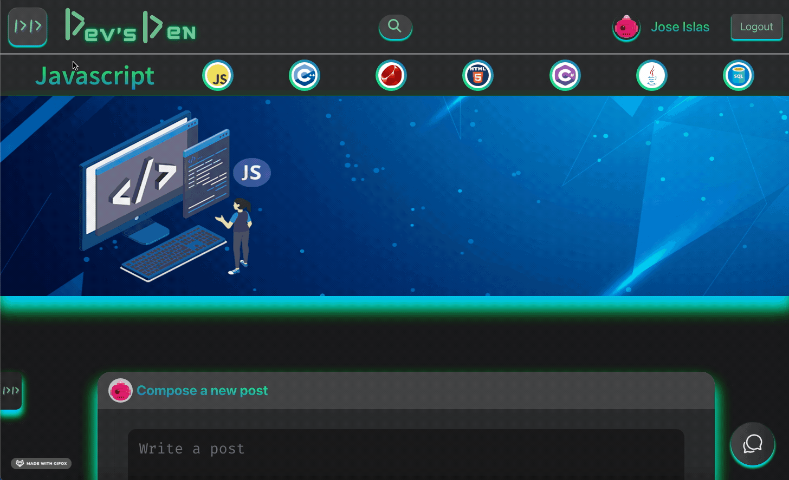
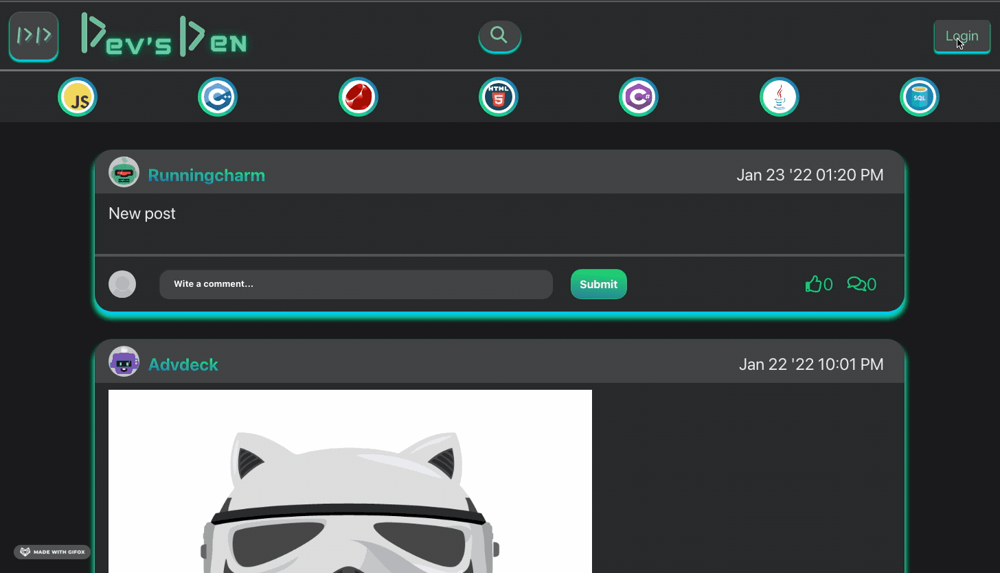
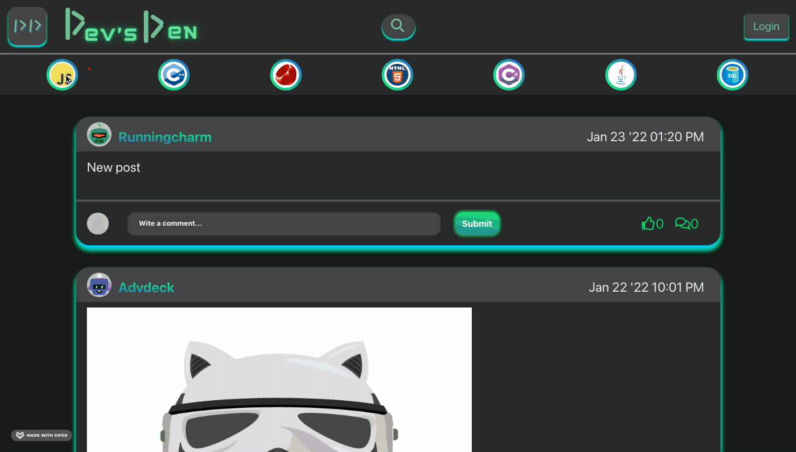
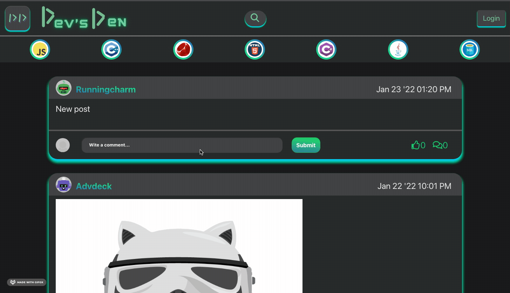
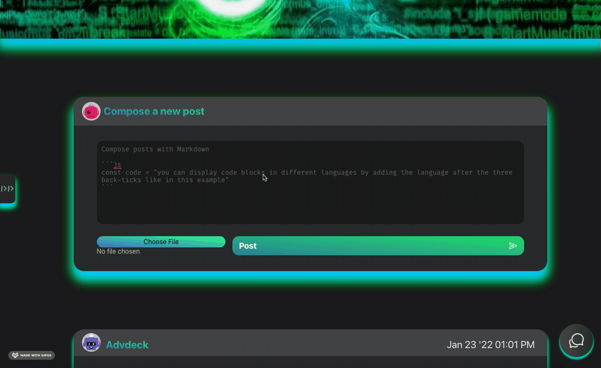
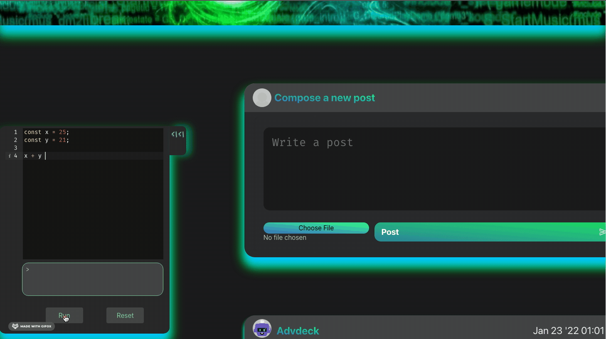
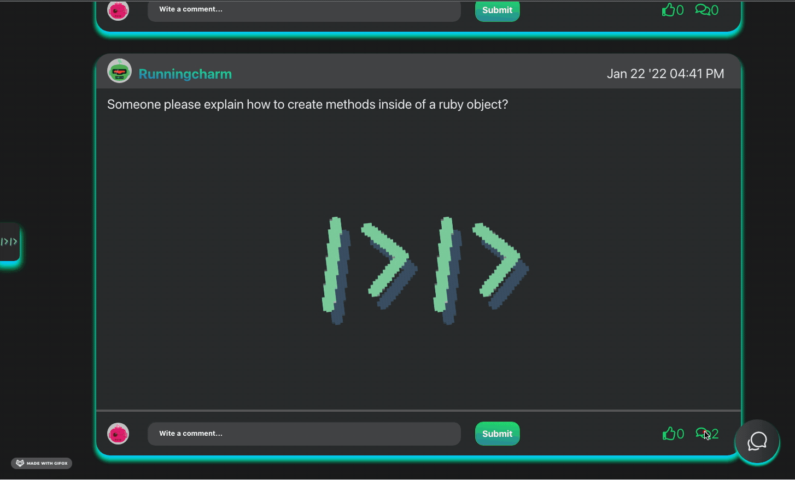

[]()
[]()
[]()


# Devs-Den

Social Media Platform for Web Developers and Software Engineers that provides various ways to communicate, learn and spread knowledge.

Dev's Den is designed to give users the best experience and tools to share ideas, resources and takle problems as a community.

## Functionality

### Home Page & Search-bar


Home Page, displays the last current posts from every forum, and the searh bar can display from all the posts the ones that match your query

### Login & Sign Up


If you are already registered you can hit the login button, otherwise you can register by hitting the sign up link.

### Forum Navigation


Anyone is able to benefit from the community, and moving through forums is as simple as a click in the category.

### Limited Functionality for guests


If you dont have an account yet, hurry up and sign up you are missing out on sharing with the Devs Den community. And it will show when you try to comment or post.

### Chat


As a registered user you can chat with fellow developers in realtime !!!!

### Upload Images


Registered devs can upload images to show coding errors, or to share the issues they are facing.

### Markdown is accepted in posts and comments


Registered devs can share their code blocks by putting their content inside three back-ticks Example:
<br> \```<Language-shortcut (js)>
<br>Your code goes inside<br>
\```

### IDE Supporst Javascript at the moment


Becasue we are a devs community we want the best tools for our devs, and we have included a functional javascript IDE that you can try code with to check if it is correct.

### Show Comments and Liking posts


In order to show comments you just have to click on the little comment icon, to display the comments and if you want to like the posts you can give a thumbs up.

## Project Structure

- [Front-End](/Client)
  - [Components](/Client/src/components)
  - [Helper Functions](/Client/src/helpers)
  - [Styles](/Client/src/components/Styles)
- [Back-End](/Server)
  - [Database](/Server/db)
    - [Queries](/Server/db/queries)
    - [Schemas](/Server/db/schema)
    - [Seeds](/Server/db/seeds)
  - [API-Routes](/Server/routes)
